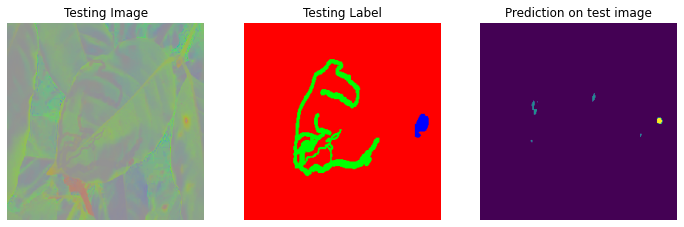

# Semantic Segmantation

---

## Data labeling

 

Tool: [MVTec Deeplearning Tool 22.06](https://www.mvtec.com/products/deep-learning-tool) 

### Label: Sau ve bua

### Label: Nam ri sat

### Overview:

- 534 images
- Sau ve bua: 327 objects
- Nam ri sat: 531 objects

## Build model unet

## Without augmented
### Version 1

* num parameters: 7.699.011

* Accuracy on test set: 0.9669

* Kết quả dự đoán ở class 1 chưa tốt

## Difficult

* Dữ liệu khá ít, nên để tránh trước việc ovefitting nên mạng unet đã được cắt bớt, giảm số lượng tham số xuống còn khoảng 7tr, trong khi model gốc khoảng 31tr

* Dữ liệu ít làm cho model dự đoán không tốt. Mặc dù accuracy cao ~0.9669, vì khi label đưa vào mạng, label đã được categorical, và label 0 trong label chiếm số lượng lớn, trong khi các label chính là 0 và 1 chiếm số lượng nhỏ. Mô hình dự đoán phần lớn các pixel là 0 vì vậy mà accuraccy cao và không tăng khi đạt 0.967.

* Khi training đặt số lượng epoch là 100, và early stoppng theo dõi val_loss, patience=2, vì patience khá thấp cho nên model không train được nhiều (~8 epoch) và accuracy đạt khoảng 0.96. Kết quả test thì model dự đoán toán label 0. Khi tăng patience lên thì model đã train được nhiều hơn và accuracy lên 0.99. Kết quả test cũng khả quan hơn
