# Semantic Segmantation
Install requirements
<pre>
pip install -r requirements.txt
</pre>
Train
<pre>
python3 train.py --img_path aug_imgs/ --label_path aug_labels/ --shape 256 --batch_size 16
</pre>

Test
<pre>
python3 test.py --img_path aug_imgs/IMG_2144.JPG --model segmantation.h5
</pre>
---

## Data labeling

 

Tool: [MVTec Deeplearning Tool 22.06](https://www.mvtec.com/products/deep-learning-tool) 

### Label 1: Sau ve bua

### Label 2: Nam ri sat

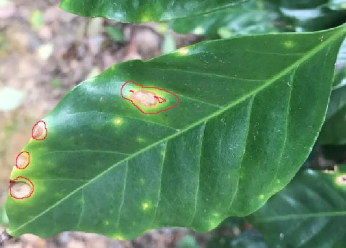

### Overview:

- 534 images
- Sau ve bua: 327 objects
- Nam ri sat: 531 objects

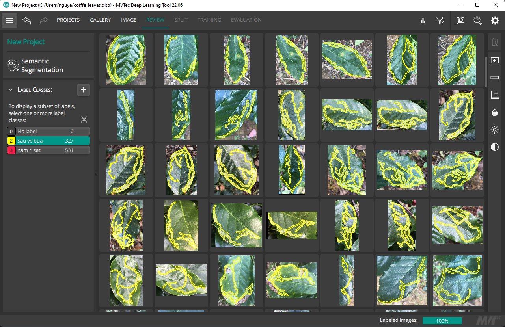

## Build model unet

## Version 1

### Without augmentation

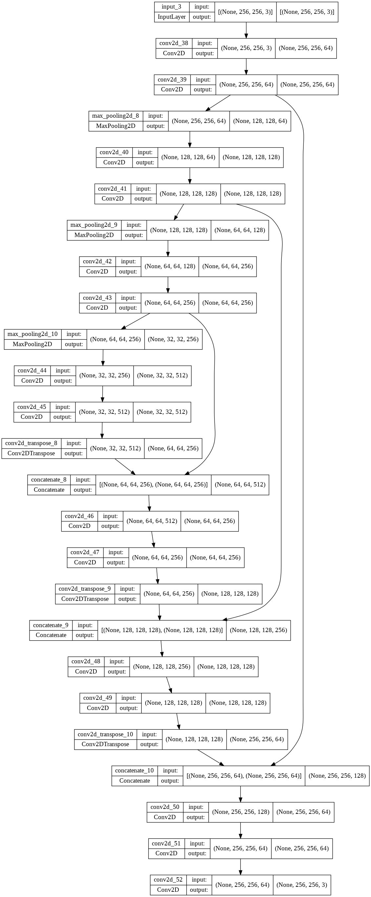

* num parameters: 7.699.011

* training:

<a align="center" style="inline_block">
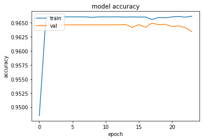
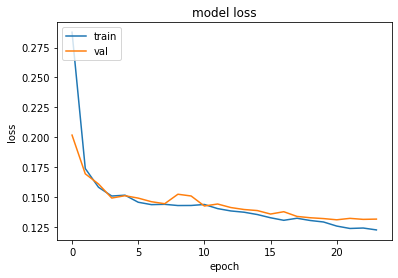
</a>

* Accuracy on test set: 0.9669

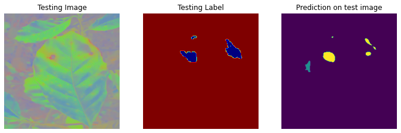
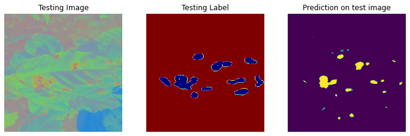
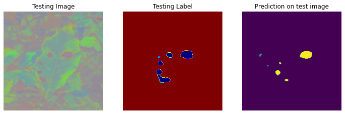
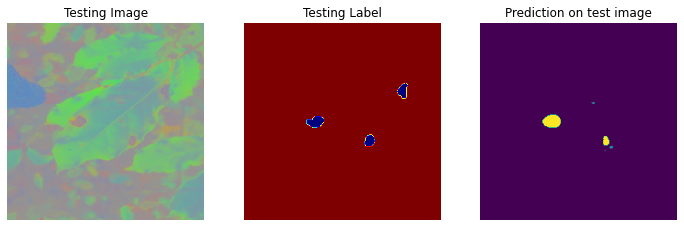

* Dữ liệu khá ít, nên để tránh trước việc overfitting nên mạng unet đã được cắt giảm bớt 1 block downsample và 1 block upsample so với kiến trúc gốc, giảm số lượng tham số xuống còn khoảng 7 tr, trong khi model gốc khoảng 31tr

* Model cho ra accuracy khá cao tuy nhiên kết quả test rất tệ. Có thể lý giải như sau. Kích thước ảnh đưa vào mạng là 256 x 256 trong có có rất nhiều pixel mang label 0 (background) khi mô hình dự đoán, đa phần các pixel được dự đoán mang giá trị là 0 điều này làm cho accuracy cao. Trong khi đó các label 1 và label 2 không dự đoán được làm cho kết quả test trên dữ liệu thật tệ.

### With augmentation

* Các phép biến đổi được dùng để tăng cường dữ liệu bao gồm:

	* Horizontal flip
	* Vertical flip
	* Rotate
	* Shear
	* Scale
	* Translate
	* Brighness
	* Crop

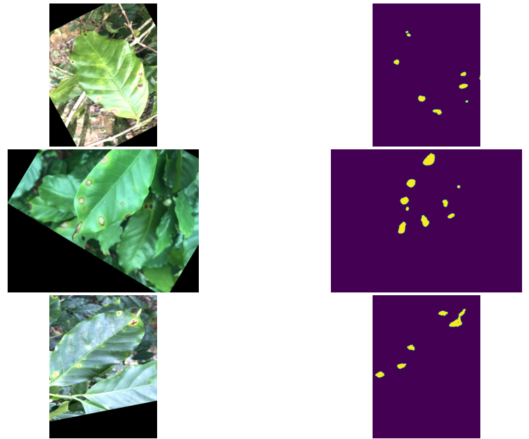

* Dữ liệu = (num images) * 5 + (num images) = 3024 images

* Vì khi load dữ liệu với size 256x256 vào ram để đưa vào model thì sẽ làm cho colab mất kết nối do tràn ram do đó phải viết lại hàm train model theo từng batch và đọc ảnh từ path của image

* Khi training đặt số lượng epoch là 100, và early stoppng theo dõi val_loss, patience=2, vì patience khá thấp cho nên model không train được nhiều (~8 epoch) và accuracy đạt khoảng 0.96. Kết quả test thì model dự đoán đa số là label 0 làm cho kết quả thực tế không tốt. Khi tăng patience lên thì model đã train được nhiều hơn và accuracy lên 0.99. Kết quả test cũng chính xác hơn

* training:

<a align="center" style="inline_block">
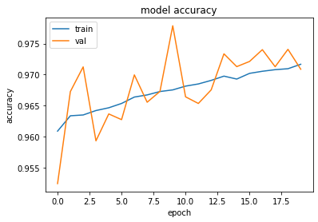
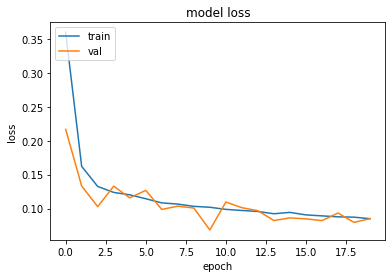
</a>

* testing:

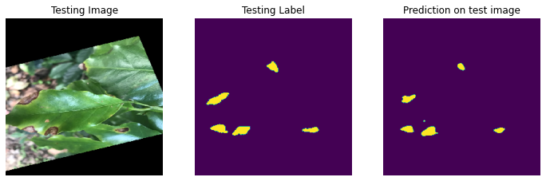
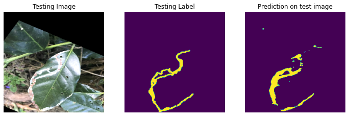
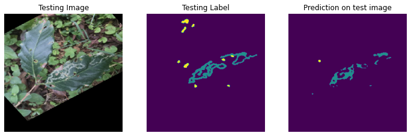
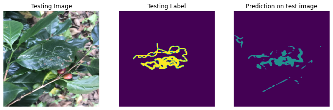

## Version 2

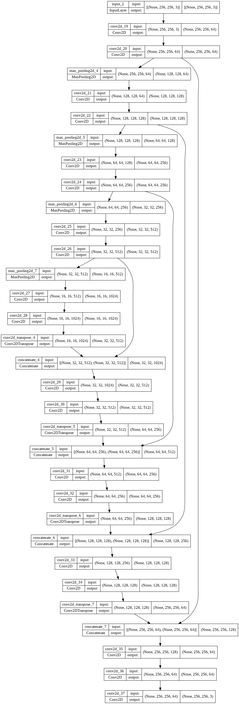

* numparameters: 31,033,411

### with augmentation

* training:

<a align="center" style="inline_block">
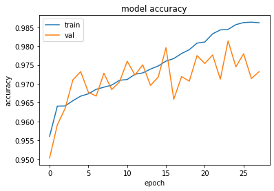
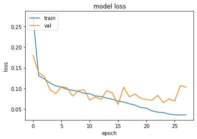
</a>

* testing:

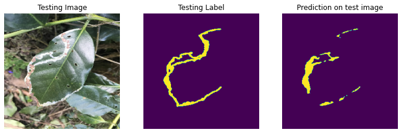
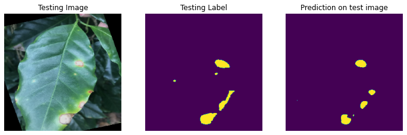
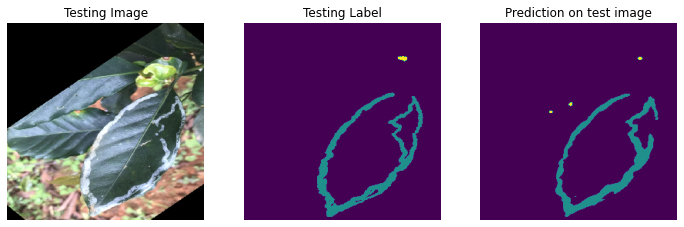
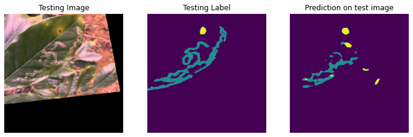

* Kết quả test trên dữ liệu cho thấy model đã học được cách phát hiện được bệnh, phát hiện khá chính xác. Tuy nhiên một số những điểm ảnh bị chói sáng do ánh sáng mặt trời thì model phát hiện thành bệnh sâu vẽ bùa.
